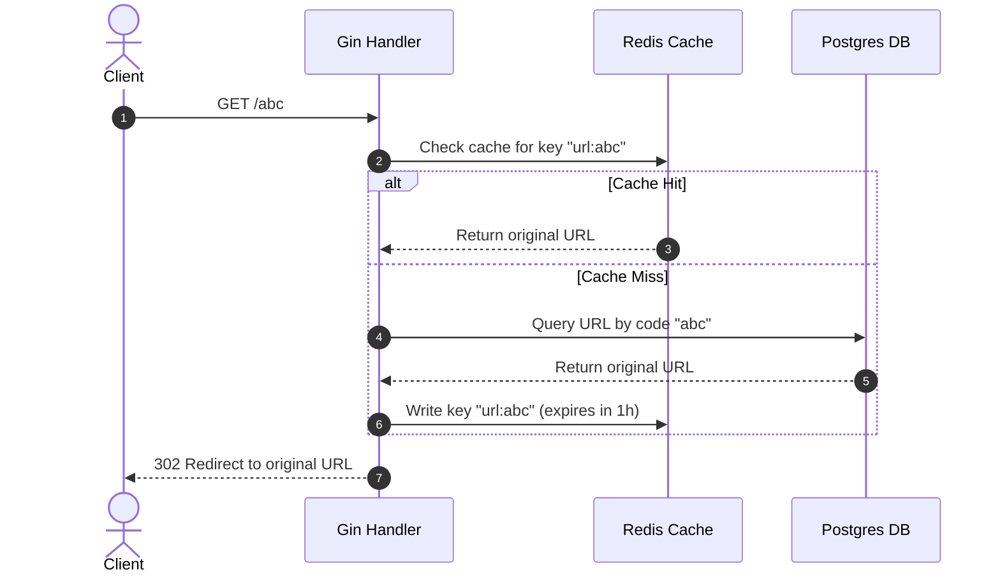

# 📐 System Architecture & Design

This document details the architectural patterns, layers, and data flows of the Snippy URL Shortener service.

---

## 🏛️ Clean Architecture Layers

The backend codebase is structured using Clean Architecture principles, ensuring separation of concerns, testability, and independence from external databases or frameworks.

```text
  ┌─────────────────────────────────────────────────────────┐
  │                        HANDLERS                         │
  │  (HTTP routing, request binding, input validation)     │
  └────────────┬───────────────────────────────┬────────────┘
               │                               │
               ▼                               ▼
  ┌────────────────────────┐       ┌────────────────────────┐
  │     CACHE INTERFACE    │       │  REPOSITORY INTERFACE  │
  │ (Redis implementations)│       │ (Postgres implement.)  │
  └────────────────────────┘       └────────────────────────┘
```

### 1. Presentation Layer (`internal/handlers`)
* **Role**: Exposes HTTP endpoints, parses incoming JSON request bodies, and validates input.
* **Details**: Powered by the Gin framework. Handlers interact solely with abstract interfaces (Repository and Cache) rather than concrete implementations.
* **HTTP Responses**: Standardized JSON responses are serialized using the `internal/response` package to ensure API consistency.

### 2. Domain & Data Access Layer (`internal/repository`)
* **Role**: Executes queries against the PostgreSQL database.
* **Pattern**: Implements the Repository Pattern. All DB interactions are defined as methods on repository interfaces.
* **Separation**: The database layer is decoupled from business logic, facilitating mock-based unit tests for the handlers.

### 3. Middleware (`internal/middleware`)
* **Role**: Handles cross-cutting concerns for requests.
* **Examples**:
  * **JWT Authentication**: Validates tokens, extracts claims, and updates context.
  * **Rate Limiter**: Implements an IP-based token bucket rate limiter to protect resources.
  * **CORS**: Defines allowed origins, methods, and headers.
  * **Request Logger & ID**: Tracks latency and injects unique request correlation IDs (`slog`).

### 4. Cache Layer (`internal/cache`)
* **Role**: Implements cache-aside behavior to speed up redirect operations and reduce database load.
* **Pattern**: Implements a standard `Cache` interface with get, set, and delete operations.

---

## 🔄 Request Flow & Caching Strategy

The redirect handler (`GET /{code}`) utilizes a **Cache-Aside Pattern** to optimize redirects:



---

## 🔌 Dependency Injection (DI)

All dependencies are constructed and wired together during the application bootstrap phase in `main.go`. This makes dependency mocking straightforward:

1. **Config Initialization**: Loads and validates environment variables.
2. **Database Initialization**: Connects to Postgres and runs migrations.
3. **Cache Initialization**: Connects to the Redis client.
4. **Repository Setup**: Binds the active DB connection pool to the repository struct.
5. **Handler Wiring**: Inject the repository and cache implementations into the handlers.
6. **Routes Binding**: Registers the handlers with the Gin router.
